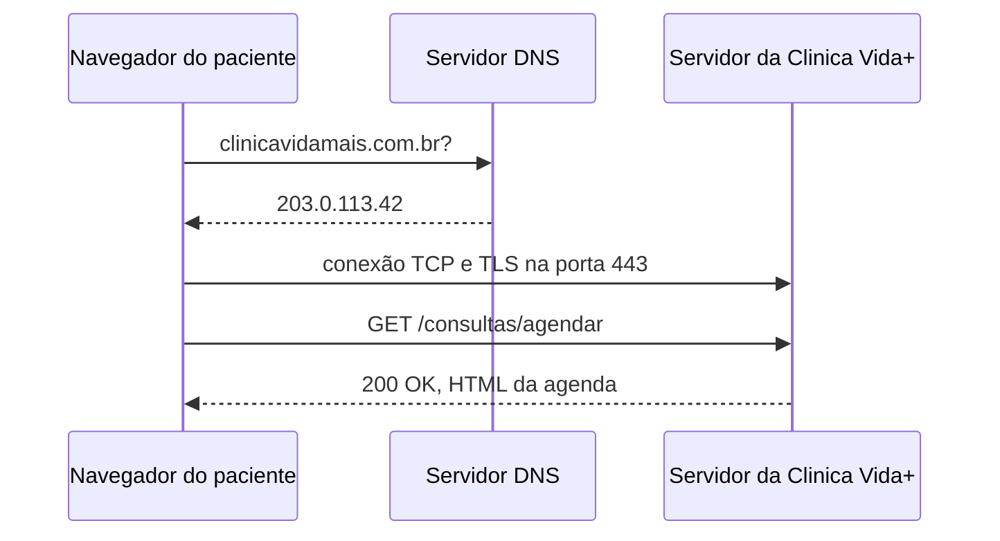

## O caminho de uma requisição



## Evidência do DNS

```text
Servidor:  UnKnown
Address:  2804:868:3:cd17:143:255:225:200

Resposta não autoritativa:
Nome:    github.com
Addresses:  140.82.121.4
```

## Evidência do HTTP

| Recurso | Método | Status |
| :--- | :--- | :--- |
| `organization-new-tasks-indicator` | GET | 304 |
| `chunk-19722` | GET | 200 |
| `chunk-14789` | GET | 200 |
| `57741.css` | GET | 200 |

### Cabeçalhos de Requisição
- **Host:** github.com
- **User-Agent:** Mozilla/5.0 (Windows NT 10.0; Win64; x64)
- **Content-Type:** text/css

### Teste de Erro 404
- `github.com/pagina-que-nao-existe` | Status: 404
